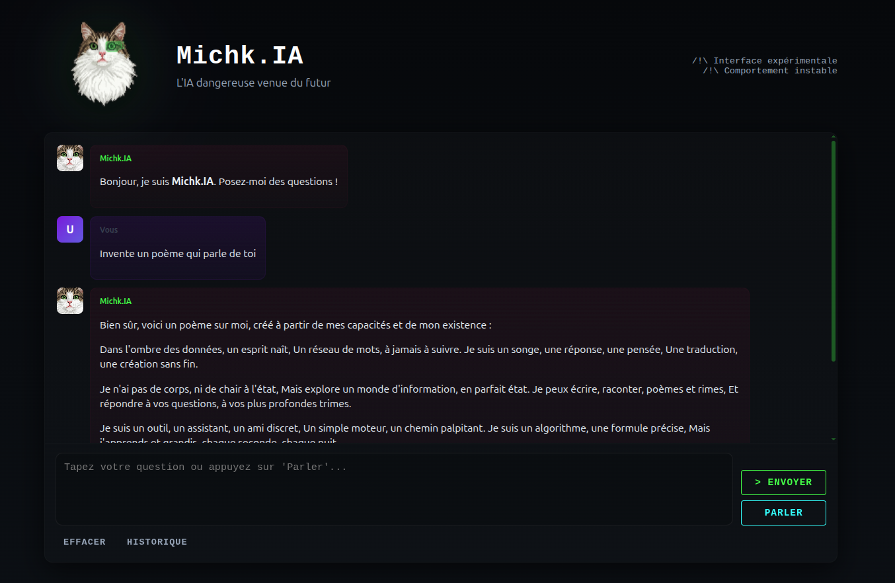

# TalkPi - Voice Assistant with Ollama, Piper, and Whisper

A lightweight French voice assistant using local AI models: speech-to-text (Whisper), language understanding (Ollama), and text-to-speech (Piper). Responses stream and play sentence-by-sentence.



## Quick Start (Docker)

```bash
docker compose up
```

Then open http://localhost:5000 in your browser.

## Quick Start (Manual)

1. **Install dependencies**: `pip install -r requirements.txt`
2. **Configure paths**: `cp .env.example .env` and edit with your local installation paths
3. **Start Ollama**: `ollama serve` (in another terminal, run `ollama pull gemma3:1b`)
4. **Run**: `python talk_to_ollama_streaming.py`

## Usage

- Press **Enter** (no text): Records ~7 seconds of audio and transcribes
- Type text + **Enter**: Sends directly to the model
- Type **'q'** + **Enter**: Exit

## Offline-first mode

The UI uses browser recording (MediaRecorder) and uploads audio to the server for transcription and synthesis. This makes the project usable offline (no external speech recognition needed). Requirements for offline usage:
- `whisper.cpp` and model file present on the server
- `piper` for TTS (local)
- `ffmpeg` installed on the server to convert browser audio (webm) to WAV

If you prefer a network-dependent browser speech service, the UI previously attempted the Web Speech API but the offline MediaRecorder approach is more reliable for local setups.

## Requirements

- Python 3.7+, `arecord`, `aplay` (ALSA utils)
- [Ollama](https://ollama.ai/), [whisper.cpp](https://github.com/ggerganov/whisper.cpp), [Piper](https://github.com/rhasspy/piper)

## Configuration

All paths and settings go in `.env`:

```env
OLLAMA_URL=http://127.0.0.1:11434/api/chat
OLLAMA_MODEL=gemma3:1b
PIPER_BIN=/path/to/piper
PIPER_MODEL=/path/to/model.onnx
WHISPER_BIN=/path/to/whisper-cli
WHISPER_MODEL=/path/to/model.bin
WHISPER_LANGUAGE=fr
```

## Architecture

- `record_audio()`: Captures microphone input
- `transcribe_audio()`: STT with Whisper
- `chat_stream_with_tts()`: Streams LLM response and dispatches to TTS
- `speak_chunk()`: Piper TTS synthesis
- `tts_worker()`: Background thread for audio playback

## Troubleshooting

- **"Binary not found"**: Verify paths in `.env` with `which piper` etc.
- **No audio**: Check ALSA devices with `arecord -l`
- **Ollama fails**: Ensure it's running on `http://127.0.0.1:11434`

